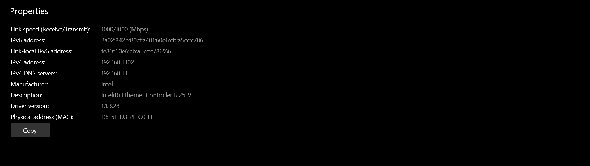
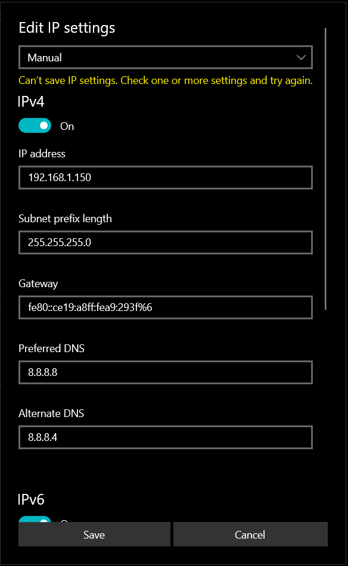

#I.Exploration locale en solo
##1. Affichage d'informations sur la pile TCP/IP locale
### En ligne de commande
####Afficher les infos des cartes reseau de votre PC 
`ipconfig/all`
 
> Name: Intel(R) Ethernet Controller I225-V  
> Adresse MAC: D8-5E-D3-2F-C0-EE  
> IPV4: 192.168.1.102
####Affichez votre gateway
> Default Gateway: fe80::ce19:a8ff:fea9:293f%6
###En graphique (GUI)

####Questions
> Le gateway dans le reseau YNOV permet de se connecter au reseau Internet
##2. Modifications des informations
###A. Modification d'adresse IP (part 1)

>Si l'on perd l'acces a internet lorsque qu'on modifie son adresse IP cela veut dire qu'on a choisi une adresse IP 
> qui existe deja sur le reseau. Pas de bol :/
#II.Exploration locale en duo
>Addresse IPV4: 192.168.1.1  
>Envoi d’une requête 'Ping'  192.168.1.2 avec 32 octets de données :
>Réponse de 192.168.1.2 : octets=32 temps=1 ms TTL=64  
Réponse de 192.168.1.2 : octets=32 temps=1 ms TTL=64  
Réponse de 192.168.1.2 : octets=32 temps=1 ms TTL=64  
Réponse de 192.168.1.2 : octets=32 temps=1 ms TTL=64  
>Statistiques Ping pour 192.168.1.2:  
Paquets : envoyés = 4, reçus = 4, perdus = 0 (perte 0%),  
Durée approximative des boucles en millisecondes :    
Minimum = 1ms, Maximum = 1ms, Moyenne = 1ms  
>C:\Users\Théo>arp -a 192.168.1.2  
Interface : 192.168.1.1 --- 0x6  
>Adresse Internet      Adresse physique      Type  
192.168.1.2           48-65-ee-1f-18-56     dynamique  

> Détermination de l’itinéraire vers MACBOOKPRO-6BE9 [192.168.1.2]
avec un maximum de 30 sauts :  
1    <1 ms     2 ms     1 ms  MACBOOKPRO-6BE9 [192.168.1.2]  
> Itinéraire déterminé.  
Côté serveur :  
C:\Users\Théo\Downloads\netcat-win32-1.11\netcat-1.11>nc -l -p 8888  
- salut
- yo !  
- kjfgjsekl  
- ça marche  
> Côté client :  
MacBook-Pro-de-saperlipopette:~ marieliserenzema$ nc 192.168.1.1 8888  
C:\Users\Théo\Downloads\netcat-win32-1.11\netcat-1.11>nc -l -p 9999 -s 192.168.1.1  
PS C:\WINDOWS\system32> netstat -a -n -b | select-string 9999  
TCP    0.0.0.0:9999           0.0.0.0:0              LISTENING  
PS C:\WINDOWS\system32> netstat -a -n -b | select-string 9999  
TCP    192.168.1.1:9999       0.0.0.0:0              LISTENING   
>Avec firewall d’activé :  
C:\Users\Théo\Downloads\netcat-win32-1.11\netcat-1.11>ping 192.168.1.2  
>Envoi d’une requête 'Ping'  192.168.1.2 avec 32 octets de données :  
Réponse de 192.168.1.2 : octets=32 temps<1ms TTL=64  
Réponse de 192.168.1.2 : octets=32 temps<1ms TTL=64  
Réponse de 192.168.1.2 : octets=32 temps=1 ms TTL=64  
Réponse de 192.168.1.2 : octets=32 temps<1ms TTL=64  
Statistiques Ping pour 192.168.1.2:  
Paquets : envoyés = 4, reçus = 4, perdus = 0 (perte 0%),  
Durée approximative des boucles en millisecondes :  
Minimum = 0ms, Maximum = 1ms, Moyenne = 0ms  
C:\Users\Théo\Downloads\netcat-win32-1.11\netcat-1.11>nc -l -p 888  
#III.Manipulations d'autres outils/protocoles cote client
##1.DHCP
>DHCP Address: 10.33.19.254
>Lease Expires: Thursday, September 29, 2022 2:33:19 PM
##2.DNS
>Serveur google: 8.8.8.8  
>En premiere partie nslookup nous donne le nom du serveur avec lequel on communique puis l'adresse de ce dernier  
>En deuxieme partie nslookup nous renvoie les adresses IP des serveurs  
> Nom du domaine pour 78.74.21.21 ==> host-78-74-21-21.homerun.telia.com  
> Nom du domaine pour 92.146.54.88 can't find on dns server
#IV.Wireshark

